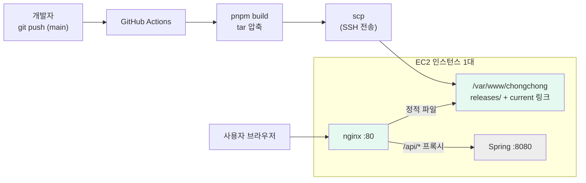

# 버전 2 — EC2에 Spring과 함께 배포

## 한 줄 요약

빌드 결과물을 **EC2 서버 안의 폴더로 전송**하고, 그 서버에서 돌고 있는 **nginx가 그 폴더를 서빙**한다. `/api`로 오는 요청만 같은 서버의 스프링(8080)으로 넘긴다.

---

## 개념부터: 여기서 프론트가 신경 쓸 것

EC2는 "AWS가 빌려주는 리눅스 컴퓨터 한 대"다. 그 한 대 안에서 스프링과 프론트 파일이 공존한다. 프론트엔드 입장에서 달라지는 건 **파일을 어디에 두고 누가 서빙하느냐**뿐이고, 스프링 코드는 몰라도 된다.

| 용어      | 처음 보는 사람을 위한 설명                                                |
| --------- | ------------------------------------------------------------------------- |
| **EC2**   | AWS가 빌려주는 가상 컴퓨터. SSH로 접속해서 직접 쓴다                      |
| **nginx** | 웹서버. 정적 파일을 내려주고, 특정 경로 요청은 다른 프로그램에 넘겨준다   |
| **리버스 프록시** | 위의 "넘겨준다"에 해당. `/api/*`를 스프링에 전달하는 역할          |
| **SSH / 키페어** | 서버에 접속하는 방법과 열쇠. 이 열쇠를 GitHub Secrets에 넣는다     |
| **보안 그룹** | 서버의 방화벽. 어떤 포트를 누구에게 열지 정한다                       |

### 왜 nginx를 거치는가 (중요)

스프링이 프론트 파일까지 같이 서빙하게 만들 수도 있다(`src/main/resources/static`). 하지만 그러면 **프론트를 한 글자 고쳐도 백엔드 전체를 다시 빌드·재시작**해야 한다. nginx로 분리하면 프론트 배포가 백엔드와 독립적으로 돌아간다. 프론트 담당자 입장에서 이 차이는 매우 크다.

---

## 배포 흐름



브라우저가 보는 주소는 **하나뿐**이다. `/`는 리액트 파일, `/api/*`는 스프링. 같은 오리진이라 **CORS 문제가 애초에 발생하지 않는다.**

---

## 서버 준비 (최초 1회, 약 40분)

### 1. EC2 인스턴스 (보통 백엔드가 이미 만들어 둔 것을 함께 쓴다)

- Ubuntu 22.04 / 24.04, 프리티어면 t2.micro 또는 t3.micro
- 키페어(`.pem`) 생성 후 안전하게 보관

### 2. 보안 그룹 (방화벽)

| 포트 | 소스        | 용도                                    |
| ---- | ----------- | --------------------------------------- |
| 80   | `0.0.0.0/0` | 사용자 접속                             |
| 443  | `0.0.0.0/0` | HTTPS (인증서 붙인 뒤)                  |
| 22   | 내 IP       | SSH. 다만 Actions가 접속하려면 아래 참고 |
| 8080 | **열지 않음** | nginx가 내부에서만 접근하므로 불필요  |

> GitHub Actions 러너는 IP가 매번 바뀌어서 22번을 특정 IP로만 열면 배포가 실패한다. POC 단계에서는 22번을 열어두되, 운영에서는 **AWS SSM Session Manager**를 쓰면 22번을 아예 닫을 수 있다.

### 3. nginx 설치 및 디렉터리 세팅

리포지토리를 서버에 올린 뒤 [`setup-ec2.sh`](./setup-ec2.sh)를 한 번 실행하면 아래가 처리된다.

```bash
ssh -i 키.pem ubuntu@<EC2-퍼블릭-IP>
# 스크립트 내용을 참고해 직접 쳐봐도 좋다 (뭘 하는지 알게 된다)
./setup-ec2.sh
```

만들어지는 구조:

```
/var/www/chongchong/
├── releases/
│   ├── 20260820_101500/   ← 이전 배포
│   └── 20260820_143000/   ← 새 배포
└── current -> releases/20260820_143000   (심볼릭 링크)
```

nginx는 `current`만 바라본다. 배포는 **링크를 갈아끼우는 것**이므로 순간적으로 끝나고, 문제가 생기면 링크를 이전 폴더로 되돌리면 즉시 롤백이다.

### 4. GitHub Secrets 등록

| 이름          | 값                                              |
| ------------- | ----------------------------------------------- |
| `EC2_HOST`    | EC2 퍼블릭 IP 또는 도메인                       |
| `EC2_USER`    | `ubuntu`                                        |
| `EC2_SSH_KEY` | `.pem` 파일의 **전체 내용** (`-----BEGIN`부터 끝까지) |

---

## 워크플로 해설

파일: [`.github/workflows/deploy-ec2.yml`](../.github/workflows/deploy-ec2.yml)

| 단계             | 하는 일                                                       |
| ---------------- | ------------------------------------------------------------- |
| `pnpm build`     | **러너에서** 빌드한다 (아래 설명)                             |
| `tar -czf`       | dist를 압축. 파일 수백 개를 하나로 묶어 전송이 빨라진다       |
| `scp-action`     | 압축 파일을 EC2의 `/tmp`로 전송                               |
| `ssh-action`     | 서버에서 압축을 풀고 심볼릭 링크를 교체, 오래된 릴리스 정리   |

### 빌드를 서버가 아니라 러너에서 하는 이유

프리티어 t2.micro는 램이 1GB다. webpack 프로덕션 빌드는 이 정도에서 **OOM으로 죽는 일이 흔하다.** 또 서버에 node와 소스코드를 두지 않아도 되므로 서버가 단순해진다. "빌드는 CI에서, 서버에는 결과물만"이 원칙이다.

---

## POC 확인 방법

1. `frontend/src/App.tsx`의 `MESSAGE` 수정 후 push
2. Actions 초록불 확인
3. `http://<EC2 퍼블릭 IP>` 새로고침 → 문구/커밋 해시 변경 확인
4. 서버에서 `ls -l /var/www/chongchong/` → `current` 링크가 새 폴더를 가리키는지 확인

---

## 이 방식의 장단점 (프론트엔드 관점)

**좋은 점**

- **CORS가 없다.** 같은 오리진이라 쿠키 인증도 그냥 동작한다. 총총처럼 소셜 로그인 + 세션/쿠키를 쓸 계획이면 초기 난이도가 확 낮아진다
- 이미 백엔드가 EC2를 쓰고 있다면 인프라를 추가로 만들 필요가 없다
- nginx 설정 하나로 프록시·캐시·리다이렉트를 다 제어할 수 있다

**주의할 점**

- 서버 한 대가 죽으면 프론트도 같이 죽는다
- nginx·보안그룹·SSH 키 등 **관리할 것이 늘어난다**. 프론트만 하고 싶어도 서버를 어느 정도 알아야 한다
- 트래픽이 늘면 직접 스케일링 고민이 필요하다
- SSH 키를 Secrets에 두는 구조라 키 관리가 중요하다

---

## 아무것도 준비 안 된 상태에서의 진행 플랜

### 0단계 — 백엔드와 합의부터 (30분)

프론트 혼자 정할 수 없는 것들이다. 먼저 물어볼 것:

- EC2에 nginx를 앞단에 두는 데 동의하는지 (스프링이 직접 80을 잡고 있으면 8080으로 내려야 한다)
- API 경로 프리픽스를 `/api`로 통일할 수 있는지
- SSH 접속 계정과 키를 프론트도 쓸 수 있는지

> 이 합의가 이 버전의 가장 큰 리스크다. 코드보다 먼저 처리하는 게 좋다.

### 1단계 — 손으로 한 번 올려본다 (1시간)

- 로컬에서 `pnpm build`
- `scp -i 키.pem -r dist/* ubuntu@IP:/var/www/chongchong/current/`
- nginx 설정 붙이고 `sudo nginx -t && sudo systemctl reload nginx`
- 브라우저로 IP 접속 → 화면이 뜨면 성공

### 2단계 — SPA 라우팅과 프록시 확인 (30분)

- `/아무경로` 새로고침 → `try_files ... /index.html`이 없으면 여기서 404가 난다. 있으면 정상 동작
- `curl http://IP/api/health` → 스프링 응답이 오는지 확인

### 3단계 — Actions로 자동화 (1시간)

- Secrets 3개 등록
- `deploy-ec2.yml` 추가 후 push
- 실패하면 대부분 **SSH 키 형식** 아니면 **디렉터리 권한** 문제다. Actions 로그의 에러 메시지를 그대로 읽으면 대개 답이 나온다

### 4단계 — 릴리스 디렉터리 구조 도입 (30분)

- `current` 심볼릭 링크 방식으로 전환
- 롤백을 한 번 연습해 본다: `ln -sfn releases/이전폴더 current`

### 5단계 — 운영 준비 (필요해질 때)

- **HTTPS**: Let's Encrypt(certbot)로 무료 인증서. 도메인이 필요하다
- **SSM 접속**으로 전환해 22번 포트 폐쇄
- 정적 파일만 S3+CloudFront로 떼어내는 하이브리드 (트래픽이 늘면 자연스러운 다음 수순)
