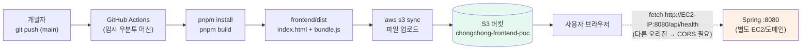

# 버전 1 — S3 정적 호스팅 배포

## 한 줄 요약

리액트를 빌드하면 나오는 `dist/` 폴더(= HTML 1개 + JS/CSS 몇 개)를 **S3라는 파일 보관함에 그대로 복사**한다. 그게 배포의 전부다.

---

## 개념부터: 왜 "복사"가 배포인가

리액트 앱은 실행되는 서버가 필요 없다. 빌드 결과물은 그냥 **파일 덩어리**이고, 브라우저가 그 파일을 내려받아 브라우저 안에서 실행한다. 그래서 프론트엔드 배포란 "그 파일들을 누구나 내려받을 수 있는 곳에 갖다 놓는 일"이다.

| 용어             | 처음 보는 사람을 위한 설명                                                      |
| ---------------- | ------------------------------------------------------------------------------- |
| **S3**           | AWS의 파일 보관함(구글 드라이브 같은 것). "버킷"이라는 폴더 단위로 파일을 넣는다 |
| **정적 웹 호스팅** | 버킷에 켤 수 있는 옵션. 켜면 보관함이 웹서버처럼 URL로 파일을 서빙해 준다        |
| **IAM**          | AWS 권한 관리. "GitHub Actions가 이 버킷에만 파일을 올릴 수 있다"를 정의하는 곳  |
| **CloudFront**   | AWS의 CDN. HTTPS와 전 세계 캐싱을 붙여준다 (POC 단계에선 생략 가능)             |
| **CD**           | 코드가 머지되면 사람 손 없이 자동으로 위 과정을 수행하는 것                     |
| **CORS**         | "다른 주소의 서버에 요청해도 되는가"를 브라우저가 검사하는 규칙. 서버가 허용해 줘야 통과 |

---

## 배포 흐름



핵심은 **프론트와 백엔드가 완전히 분리된 주소**를 갖는다는 점이다. 브라우저는 화면 파일은 S3에서, 데이터는 스프링 서버에서 각각 받아온다. 이 리포의 `backend/`가 바로 그 스프링 서버 역할이고, **점선 화살표가 이 버전의 유일한 관문**이다 — 오리진이 다르므로 CORS 허용이 없으면 브라우저가 요청을 막는다.

---

## AWS 준비 (최초 1회, 약 20분)

### 1. S3 버킷 생성

- 콘솔 → S3 → 버킷 만들기
- 이름: `chongchong-frontend-poc` (전 세계에서 유일해야 함)
- 리전: `ap-northeast-2` (서울)
- **"모든 퍼블릭 액세스 차단" 체크 해제** ← 안 풀면 접속이 안 된다

### 2. 정적 웹사이트 호스팅 켜기

버킷 → 속성 → 정적 웹 사이트 호스팅 → 활성화

- 인덱스 문서: `index.html`
- **오류 문서: `index.html`** ← 이게 SPA 라우팅의 핵심이다

> `/studies/1` 로 새로고침하면 S3에는 그런 파일이 없어 404가 난다. 오류 문서를 `index.html`로 지정하면 대신 앱을 내려주고, 그때 react-router가 경로를 해석한다.

활성화하면 `http://버킷이름.s3-website.ap-northeast-2.amazonaws.com` 주소가 생긴다.

### 3. 버킷 정책 붙이기

버킷 → 권한 → 버킷 정책에 [`bucket-policy.json`](./bucket-policy.json) 내용을 붙여넣는다 (버킷 이름 수정 필수).

### 4. 배포용 IAM 사용자 만들기

- IAM → 사용자 → 생성 (콘솔 접근 권한 불필요)
- 정책은 [`iam-policy.json`](./iam-policy.json)을 인라인 정책으로 붙인다
- 액세스 키를 발급받아 둔다

> 내 개인 계정의 루트 키를 쓰면 절대 안 된다. 유출 시 계정 전체가 털린다.

### 5. GitHub Secrets 등록

리포지토리 → Settings → Secrets and variables → Actions

| 종류       | 이름                        | 값                             |
| ---------- | --------------------------- | ------------------------------ |
| Secret     | `AWS_ACCESS_KEY_ID`         | 4번에서 받은 키                |
| Secret     | `AWS_SECRET_ACCESS_KEY`     | 4번에서 받은 시크릿            |
| Variable   | `API_BASE`                  | 스프링 서버 주소 + `/api` (예: `http://13.125.0.1:8080/api`) |
| Variable   | `CLOUDFRONT_DISTRIBUTION_ID` | (선택) CloudFront 붙였을 때만 |

> `API_BASE`에 **`/api`까지 포함**해야 한다. 프론트는 `API_BASE + "/health"` 로 호출하고 스프링은 `/api/health` 로 받으므로, `/api`가 빠지면 404가 난다.

### 6. 백엔드(스프링) 쪽 준비 ← 버전 1에만 있는 단계

`backend/`를 EC2에서 띄우고([backend/README.md](../backend/README.md)), 두 가지를 맞춰 준다.

1. **보안 그룹에서 8080을 열어 준다.** 브라우저가 스프링에 **직접** 요청하므로 8080이 인터넷에 노출되어야 한다. (버전 2는 nginx가 대신 받아 주므로 닫아 둔다)
2. **CORS 허용 주소에 S3 웹사이트 주소를 추가한다.** `backend/src/main/resources/application.properties`:

```properties
app.deploy-target=s3
app.cors.allowed-origins=http://localhost:3005,http://chongchong-frontend-poc.s3-website.ap-northeast-2.amazonaws.com
```

> 스킴(`http://`)과 포트까지 **정확히** 일치해야 한다. 브라우저 콘솔에 `No 'Access-Control-Allow-Origin' header` 가 뜬다면 이 줄을 의심한다.

---

## 워크플로 해설

파일: [`.github/workflows/deploy-s3.yml`](../.github/workflows/deploy-s3.yml)

| 단계                            | 하는 일                                                              |
| ------------------------------- | -------------------------------------------------------------------- |
| `checkout`                      | 깃허브가 빌려준 우분투 머신에 우리 코드를 내려받는다                 |
| `pnpm/action-setup` + `setup-node` | pnpm 11.9.0 / node 22 설치, 의존성 캐시                            |
| `pnpm install --frozen-lockfile` | lockfile 그대로 설치 (CI에서 버전이 멋대로 올라가는 걸 막는다)      |
| `pnpm build`                    | webpack 프로덕션 빌드 → `frontend/dist`. 이때 `API_BASE`가 번들에 **박힌다** |
| `configure-aws-credentials`     | Secrets의 키로 AWS 로그인                                            |
| `aws s3 sync --delete`          | dist를 버킷에 반영. `--delete`로 이전 배포의 잔여 파일도 정리        |
| `aws s3 cp index.html`          | index.html만 캐시 금지 헤더로 다시 올린다                            |

### 캐시 전략을 굳이 두 단계로 나눈 이유

`webpack.config.js`에서 파일명을 `[name].[contenthash].js`로 만들었다. 내용이 바뀌면 파일명이 바뀌므로 JS/CSS는 **1년 캐시**해도 안전하다. 반면 `index.html`은 이름이 고정이라 캐시되면 사용자가 옛 화면을 계속 보게 된다. 그래서 **자산은 영구 캐시, index.html은 캐시 금지**가 정석이다.

> 배포했는데 화면이 안 바뀐다면 십중팔구 이 설정 문제다.

---

## POC 확인 방법

1. `frontend/src/App.tsx`의 `MESSAGE` 문구를 아무렇게나 수정
2. `git commit && git push origin main`
3. GitHub Actions 탭에서 초록불 확인 (약 1~2분)
4. S3 웹사이트 주소를 새로고침 → 문구와 커밋 해시가 바뀌어 있으면 **프론트 배포 성공**
5. 같은 화면의 **API** 항목이 `연결 성공`인지 확인 → 여기까지 오면 **백엔드 연동까지 성공**

| 화면의 API 항목        | 뜻                                                              |
| ---------------------- | --------------------------------------------------------------- |
| `연결 성공`            | 8080 개방 + CORS 허용이 둘 다 맞았다                            |
| `연결 실패`            | 스프링이 안 떠 있거나, 8080이 막혔거나, CORS 주소가 틀렸다      |
| 콘솔에 mixed content   | 페이지는 HTTPS인데 API는 HTTP다 (CloudFront를 붙인 뒤 흔한 케이스) |

---

## 이 방식의 장단점 (프론트엔드 관점)

**좋은 점**

- 서버 관리가 없다. 트래픽이 몰려도 알아서 버틴다
- 비용이 거의 0에 수렴한다 (월 몇백 원 수준)
- 배포가 파일 복사라 빠르고, 실패해도 되돌리기 쉽다
- 백엔드 배포와 완전히 분리된다 → 프론트가 백엔드 일정에 묶이지 않는다

**주의할 점**

- **CORS**: 도메인이 달라서 스프링에 CORS 허용 설정(`app.cors.allowed-origins`)이 반드시 필요하다. **프론트 주소가 바뀔 때마다 백엔드 설정도 같이 고쳐야 한다** — 배포마다 주소가 달라지는 PR 프리뷰를 붙이면 이게 계속 걸린다. 쿠키 인증을 쓴다면 `SameSite=None; Secure`까지 챙겨야 하고, 그러려면 양쪽 다 HTTPS여야 한다 → 사실상 CloudFront가 필수가 된다
- **백엔드 포트가 인터넷에 노출된다.** 브라우저가 스프링을 직접 부르므로 8080(또는 백엔드 도메인)이 공개되어야 한다
- S3 웹사이트 엔드포인트는 **HTTP만** 지원한다. HTTPS는 CloudFront를 붙여야 생긴다. 그런데 페이지가 HTTPS가 되는 순간 **HTTP API 호출은 브라우저가 차단**하므로(mixed content), 백엔드에도 HTTPS를 붙여야 한다 → HTTPS 전환은 프론트 혼자 끝나지 않는다
- 환경변수가 빌드 시점에 번들에 박힌다. 운영/개발 주소가 다르면 빌드를 따로 해야 한다

---

## 아무것도 준비 안 된 상태에서의 진행 플랜

프론트 담당자 기준, 각 단계마다 "여기까지 되면 성공"이 명확하도록 쪼갰다.

### 1단계 — 손으로 한 번 배포해 본다 (1시간)

자동화 이전에 수동으로 성공시켜 보는 게 중요하다. 뭐가 자동화되는지 몸으로 알게 된다.

- 로컬에서 `pnpm build`
- AWS 콘솔에서 버킷 만들고, 정적 호스팅 켜고, `dist` 안의 파일을 드래그 앤 드롭
- 발급된 주소로 접속 → 화면이 뜨면 성공
- 주소창에 `/아무거나` 를 쳐보고 404가 나는지 확인 → 오류 문서 설정의 필요성을 체감

### 2단계 — CLI로 배포해 본다 (30분)

- 로컬에 AWS CLI 설치, `aws configure`로 IAM 키 등록
- `aws s3 sync dist s3://버킷명 --delete` 실행
- **이 명령 한 줄이 CD의 본체다.** Actions는 이걸 대신 쳐주는 것뿐이다

### 2.5단계 — 백엔드를 붙여 본다 (30분)

CORS를 문서로 읽는 것보다 한 번 막혀 보는 게 빠르다.

- 로컬에서 `cd backend && ./gradlew bootRun` → `curl localhost:8080/api/health` 확인
- 방금 올린 S3 주소로 접속 → 화면의 **API** 항목이 `연결 실패`이고 콘솔에 CORS 에러가 뜨는 걸 확인한다 (**이게 정상이다**)
- `application.properties`의 `app.cors.allowed-origins`에 S3 주소를 추가하고 재시작 → `연결 성공`으로 바뀌는지 확인
- 여기서 "버전 1은 프론트 배포가 백엔드 설정 변경을 부른다"를 체감하게 된다

> 백엔드를 로컬(`localhost:8080`)에 띄웠다면 S3 화면에서는 붙지 않는다. 사용자 브라우저 기준 주소이므로, 실제로 확인하려면 EC2에 올려 두고 `API_BASE`를 그 주소로 잡아야 한다.

### 3단계 — GitHub Actions로 옮긴다 (1시간)

- Secrets에 키 등록
- `deploy-s3.yml` 추가하고 push
- Actions 로그를 열어 각 스텝이 뭘 하는지 눈으로 따라간다
- 일부러 실패시켜 본다 (버킷 이름 오타 등) → 로그 읽는 법을 익힌다

### 4단계 — 캐시와 라우팅 정리 (30분)

- index.html 캐시 분리 적용
- SPA 라우팅 확인: 배포 후 `/studies/1` 새로고침

### 5단계 — 운영 준비 (필요해질 때)

- **CloudFront + ACM 인증서**로 HTTPS. 소셜 로그인(카카오/구글/애플) 리다이렉트를 붙이려면 HTTPS가 사실상 필수이니 총총에서는 이 단계를 빨리 당기는 게 좋다
- **OIDC 전환**: 액세스 키를 Secrets에 두는 대신 GitHub↔AWS 신뢰관계를 맺어 임시 자격증명을 발급받는 방식. 장기 키가 사라져 유출 위험이 없다
- **PR 프리뷰 배포**: PR 번호별 폴더(`s3://버킷/pr-123/`)에 올려 디자인 리뷰용 URL 제공. 단, 주소가 늘어나므로 백엔드 CORS 목록도 함께 관리해야 한다
- **API도 CloudFront 뒤로**: `/api/*`를 백엔드 오리진으로 라우팅하면 오리진이 하나가 되어 CORS가 사라진다. 버전 2의 nginx가 하던 일을 CloudFront가 대신하는 셈
